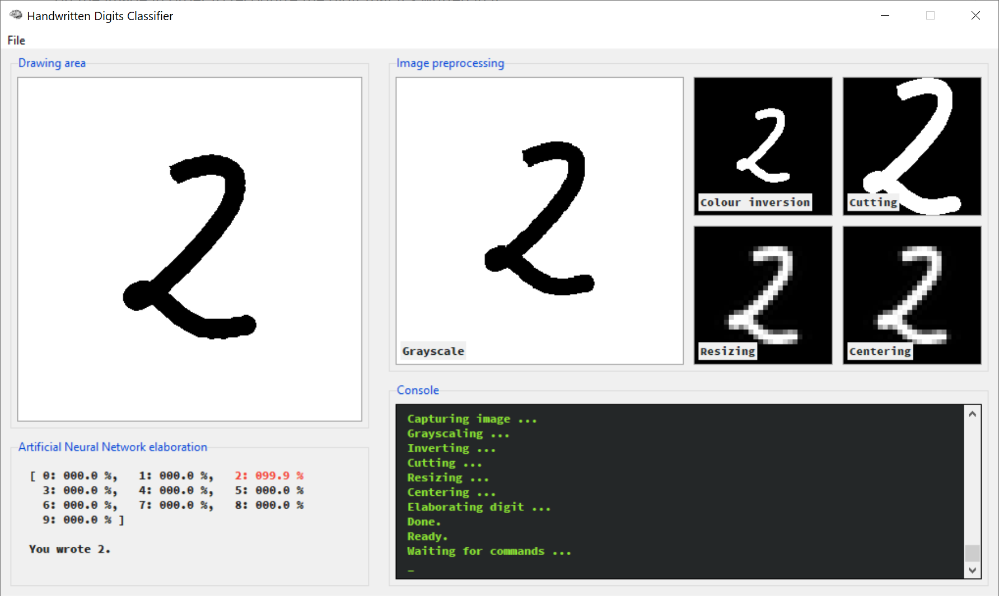

# Handwritten digits recognition

In this repository I uploaded all the software I developed for my High School thesis project.

It features a Feed-Forward Neural Network backend bundled with a simple GUI which allows the user to draw a digit inside a canvas (using touchscreen, a graphic tablet or even a mouse) and that then shows all the processing stages which are done on the image in order to recognize the digit that it's written in it.

The Feed-Forward NN was trained over the [MNIST dataset](http://yann.lecun.com/exdb/mnist/). Various trained neural networks are provided inside the `res/neural_network` folder, even if the program uses the one which scored the best results on the MNIST test dataset (97.02%).

## How it works

Just run `main.pyw` and draw a digit inside the drawing area (the top-left canvas), then press Ctrl+P to process the image. Hit Ctrl+C to clear the canvas and Ctrl+Q to quit application. If you wish to train a network yourself or to use one of the ones included in `res/neural_network`, just change the line marked as `# Settings` at the beginning of `main.pyw` with the name of the network you want to use.

You can train a network yourself by running the `train.pyw` script. You may wish to customize the parameters inside it, first, to better fit your heuristics.

## Dependencies

In order to make everything work, your local installation must include all the python dependencies included in `requirements.txt` (which can be installed with `pip install -r requirements.txt`) and [ghostscript](https://www.ghostscript.com/). Make sure that ghostscript is also included in the system path.

## Credits and license

All the work done on the feed-forward neural network is based on the first two chapters of "[Neural Networks and Deep Learning](http://neuralnetworksanddeeplearning.com/)", Michael A. Nielsen, Determination Press, 2015.
The original work was licensed under Creative Commons Attribution-NonCommercial 3.0 Unported License.

This software is licensed under the [Creative Commons Attribution-NonCommercial-ShareAlike 4.0 License](https://creativecommons.org/licenses/by-nc-sa/4.0/). This means that you are allowed to remix, transform, adapt, and build upon the software included in this repository, you can copy and redistribute it in any medium or format, under the following terms:

1. **Attribution** &ndash; you must give appropriate credit, provide a link to the license, and indicate if changes were made. You may do so in any reasonable manner, but not in any way that suggests the licensor endorses you or your use.

2. **NonCommercial** &ndash; you may not use the software included in this repository for commercial purposes.

3. **ShareAlike** &ndash; if you remix, transform, or build upon the software included in this repository, you must distribute your contributions under the same license as the original.

